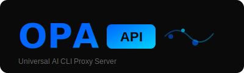

# OPA API

<p align="center">
  
</p>

<p align="center">
  <strong>🚀 Proxy Server AI CLI Thống Nhất</strong>
</p>

<p align="center">
  <a href="README_VN.md">🇻🇳 Tiếng Việt</a> |
  <a href="README.md">🇬🇧 English</a>
</p>

<p align="center">
  
  
  
</p>

---

Proxy server mạnh mẽ giúp biến các công cụ AI CLI (Gemini CLI, Claude Code, OpenAI Codex, Qwen Code, iFlow) thành API thống nhất tương thích OpenAI/Gemini/Claude/Codex.

**Phát triển bởi [OPA AI Labs](https://opa.vn)** — Agency Digital Marketing chuyên về giải pháp AI cho doanh nghiệp Việt Nam.

## ⚡ Tính Năng Chính

| Tính Năng | Mô Tả |
|-----------|-------|
| 🔐 **Hỗ trợ OAuth** | Đăng nhập qua Codex, Claude Code, Qwen Code, iFlow |
| ⚖️ **Load Balancing** | Đa tài khoản với phân phối round-robin |
| 🌊 **Streaming** | Phản hồi streaming real-time |
| 🛠️ **Tool Calling** | Hỗ trợ function calling / tools |
| 🖼️ **Multimodal** | Hỗ trợ input Text + Hình ảnh |
| 🎯 **Tương thích API** | Hoạt động với SDK OpenAI/Gemini/Claude |
| 📡 **Amp CLI** | Hỗ trợ đầy đủ IDE extension |
| 📦 **Go SDK** | SDK có thể nhúng cho ứng dụng tùy chỉnh |

## 🚀 Bắt Đầu Nhanh

### Yêu Cầu Hệ Thống

- Go 1.21+
- Git

### Cài Đặt

```bash
# Clone repository
git clone https://github.com/opa-ai-labs/opa-api.git
cd opa-api

# Build
go build -o opa-api ./cmd/server

# Chạy
./opa-api
```

### Docker

```bash
# Build image
docker build -t opa-api .

# Chạy container
docker run -d -p 8080:8080 --name opa-api opa-api
```

### Docker Compose

```bash
docker-compose up -d
```

## 📖 Cấu Hình

Copy file config mẫu và tùy chỉnh:

```bash
cp config.example.yaml config.yaml
```

### Cấu Hình Cơ Bản

```yaml
server:
  host: "0.0.0.0"
  port: 8080
  
providers:
  gemini:
    enabled: true
    accounts:
      - email: "email-cua-ban@gmail.com"
        
  claude:
    enabled: true
    accounts:
      - email: "email-cua-ban@gmail.com"
        
  codex:
    enabled: true
    accounts:
      - email: "email-cua-ban@gmail.com"
```

## 🔌 Các Provider Được Hỗ Trợ

| Provider | OAuth | Đa Tài Khoản | Trạng Thái |
|----------|-------|--------------|------------|
| Gemini CLI | ✅ | ✅ | Ổn định |
| Claude Code | ✅ | ✅ | Ổn định |
| OpenAI Codex | ✅ | ✅ | Ổn định |
| Qwen Code | ✅ | ✅ | Ổn định |
| iFlow | ✅ | ✅ | Ổn định |
| Antigravity | ✅ | ✅ | Beta |

## 📚 API Endpoints

### Tương thích OpenAI

```
POST /v1/chat/completions
POST /v1/completions
GET  /v1/models
```

### Tương thích Gemini

```
POST /v1beta/models/{model}:generateContent
POST /v1beta/models/{model}:streamGenerateContent
```

### Tương thích Claude

```
POST /v1/messages
```

### Management API

```
GET  /management/health          # Kiểm tra health
GET  /management/accounts        # Danh sách tài khoản
POST /management/accounts/add    # Thêm tài khoản
POST /management/accounts/remove # Xóa tài khoản
GET  /management/usage           # Thống kê sử dụng
```

## 🎯 Ví Dụ Sử Dụng

### Python (OpenAI SDK)

```python
from openai import OpenAI

client = OpenAI(
    base_url="http://localhost:8080/v1",
    api_key="opa-api-key"  # hoặc key tùy chỉnh
)

response = client.chat.completions.create(
    model="gemini-2.5-pro",
    messages=[{"role": "user", "content": "Xin chào!"}]
)

print(response.choices[0].message.content)
```

### Node.js

```javascript
import OpenAI from 'openai';

const client = new OpenAI({
  baseURL: 'http://localhost:8080/v1',
  apiKey: 'opa-api-key'
});

const response = await client.chat.completions.create({
  model: 'claude-sonnet-4',
  messages: [{ role: 'user', content: 'Xin chào!' }]
});

console.log(response.choices[0].message.content);
```

### cURL

```bash
curl -X POST http://localhost:8080/v1/chat/completions \
  -H "Content-Type: application/json" \
  -H "Authorization: Bearer opa-api-key" \
  -d '{
    "model": "gpt-5",
    "messages": [{"role": "user", "content": "Xin chào!"}]
  }'
```

### Sử Dụng Với Claude Code

```bash
# Set environment variable
export ANTHROPIC_BASE_URL=http://localhost:8080

# Chạy Claude Code như bình thường
claude
```

### Sử Dụng Với Cursor / Cline / Roo Code

Vào Settings → API Endpoint, thay đổi:
```
http://localhost:8080/v1
```

## 🔧 Tính Năng Nâng Cao

### Model Mapping

Route model không có sẵn sang model thay thế:

```yaml
model_mapping:
  claude-opus-4.5: claude-sonnet-4
  gpt-5-preview: gpt-5
```

### Chiến Lược Load Balancing

```yaml
load_balancing:
  strategy: "round-robin"  # hoặc "least-connections", "random"
  health_check_interval: 30s
```

### Rate Limiting

```yaml
rate_limiting:
  enabled: true
  requests_per_minute: 60
  burst: 10
```

### Tự Động Failover

```yaml
failover:
  enabled: true
  max_retries: 3
  fallback_providers:
    - gemini
    - claude
    - codex
```

## 📖 Tài Liệu SDK

- [Hướng dẫn sử dụng SDK](docs/sdk-usage.md)
- [Tính năng nâng cao](docs/sdk-advanced.md)
- [Kiểm soát truy cập](docs/sdk-access.md)
- [Hệ thống Watcher](docs/sdk-watcher.md)

## 🛡️ Lưu Ý Bảo Mật

> ⚠️ **Quan Trọng Về Bảo Mật**

1. **Bảo mật Token**: Bảo vệ OAuth token và dữ liệu session
2. **Bảo mật Mạng**: Sử dụng HTTPS trong production, hạn chế endpoint
3. **Tuân thủ ToS**: Lưu ý Terms of Service của từng provider
4. **Kiểm soát Truy cập**: Implement xác thực phù hợp khi deploy public

### Khuyến Nghị Triển Khai

```bash
# Chỉ cho phép truy cập local
./opa-api --host 127.0.0.1

# Với reverse proxy (nginx)
# Thêm authentication layer
# Sử dụng HTTPS
```

## 🔄 So Sánh Với CLIProxyAPI Gốc

| Tính Năng | CLIProxyAPI | OPA API |
|-----------|-------------|---------|
| Documentation | EN/CN | EN/VN |
| Community | Global | Vietnam-focused |
| Support | GitHub Issues | Telegram + Facebook |
| Localization | Partial | Full Vietnamese |

## 🤝 Đóng Góp

Chúng tôi hoan nghênh mọi đóng góp! Vui lòng làm theo các bước:

1. Fork repository
2. Tạo feature branch (`git checkout -b feature/tinh-nang-moi`)
3. Commit changes (`git commit -m 'Thêm tính năng mới'`)
4. Push lên branch (`git push origin feature/tinh-nang-moi`)
5. Mở Pull Request

## ❓ Câu Hỏi Thường Gặp

### Q: OPA API có miễn phí không?
**A:** Có, OPA API là phần mềm mã nguồn mở MIT license. Tuy nhiên bạn vẫn cần subscription/account của các provider (Gemini, Claude, v.v.)

### Q: Có vi phạm ToS của các provider không?
**A:** Đây là proxy không chính chủ. Mỗi provider có ToS riêng, bạn nên đọc kỹ trước khi sử dụng.

### Q: Làm sao để hỗ trợ?
**A:** Join Telegram group hoặc mở GitHub Issue.

## 📄 Giấy Phép

Project này được cấp phép theo MIT License - xem file [LICENSE](LICENSE) để biết chi tiết.

## 🙏 Credits

OPA API là fork của [CLIProxyAPI](https://github.com/router-for-me/CLIProxyAPI) bởi router-for-me, được rebrand và localize cho cộng đồng developer Việt Nam.

---

<p align="center">
  <strong>Xây dựng với ❤️ bởi <a href="https://opa.vn">OPA AI Labs</a></strong>
</p>

<p align="center">
  <a href="https://facebook.com/opavietnam">Facebook</a> •
  <a href="https://t.me/opa_ai_labs">Telegram</a> •
  <a href="mailto:hello@opa.vn">Liên hệ</a>
</p>

---

### 🌟 Nếu thấy hữu ích, hãy Star ⭐ repo này!
